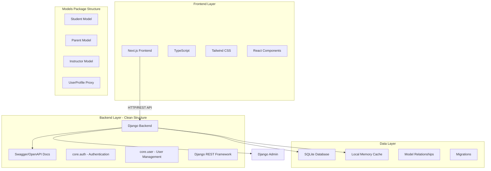

# 🚀 Wisecool Full-Stack Web Application

[](https://python.org)
[](https://djangoproject.com)
[](https://nextjs.org)
[](https://typescriptlang.org)
[](LICENSE)

A **production-ready** full-stack web application featuring a clean, modular Django REST API backend with comprehensive authentication, user management system with role-based models (Students, Parents, Instructors), automatic API documentation, and a modern Next.js frontend with TypeScript and responsive design.

## 📋 Table of Contents

- [🎯 Features](#-features)
- [🏗️ Architecture](#️-architecture)
- [📁 Project Structure](#-project-structure)
- [⚡ Quick Start](#-quick-start)
- [🔧 Installation](#-installation)
- [📚 API Documentation](#-api-documentation)
- [🌐 API Endpoints](#-api-endpoints)
- [🎨 Frontend Pages](#-frontend-pages)
- [🛠️ Technology Stack](#️-technology-stack)
- [🚀 Deployment](#-deployment)

## 🎯 Features

### 🔧 Backend Features
- ✅ **Clean Project Structure** - Organized Django apps in core directory
- ✅ **RESTful API** with Django REST Framework
- ✅ **Automatic API Documentation** with Swagger/OpenAPI via DRF Spectacular
- ✅ **User Management System** with role-based models:
  - 👨‍🎓 **Student Model** - Academic records, enrollment, GPA tracking
  - 👨‍👩‍👦 **Parent Model** - Guardian information, contact details
  - 👨‍🏫 **Instructor Model** - Teaching credentials, departments, experience
- ✅ **Authentication System** (Login, Signup, Password Management)
- ✅ **Models Package Structure** - Organized in separate files for maintainability
- ✅ **Admin Dashboard** with custom configurations for each model
- ✅ **Local Memory Caching** for improved performance
- ✅ **CORS Configuration** for frontend integration
- ✅ **Data Validation** and error handling
- ✅ **Backward Compatibility** with proxy models

### 🎨 Frontend Features
- ✅ **Modern UI/UX** with Tailwind CSS
- ✅ **TypeScript** for type safety and better development experience
- ✅ **Responsive Design** across all devices
- ✅ **Authentication Flow** (Login/Signup/Dashboard)
- ✅ **API Integration** with error handling
- ✅ **Professional Design** with gradients and animations
- ✅ **Component Architecture** for maintainability
- ✅ **Performance Optimized** with Next.js features

## 🏗️ Architecture

This application follows a **clean, modular architecture** with clear separation of concerns:



## 📁 Project Structure

```
wisecool_parent/
│
├── 🔧 Backend (Django)
│   ├── manage.py                   # 🎯 Django Management Commands
│   ├── db.sqlite3                  # 🗃️ SQLite Database
│   ├── requirements.txt            # 📦 Python Dependencies
│   │
│   ├── root/                       # ⚙️ Django Project Configuration
│   │   ├── __init__.py
│   │   ├── settings.py             # 🔧 Django Settings
│   │   ├── urls.py                 # 🛣️ Main URL Router
│   │   ├── wsgi.py                 # 🌐 WSGI Configuration
│   │   └── asgi.py                 # ⚡ ASGI Configuration
│   │
│   └── core/                       # 📦 Django Apps Directory
│       ├── auth/                   # 🔐 Authentication Module
│       │   ├── __init__.py
│       │   ├── apps.py             # ⚙️ App Configuration
│       │   ├── views.py            # 🎭 Authentication Views
│       │   └── urls.py             # 🛣️ Auth URL Patterns
│       │
│       ├── user/                   # 👥 User Management Module
│       │   ├── __init__.py
│       │   ├── apps.py             # ⚙️ App Configuration
│       │   ├── admin.py            # 🎛️ Admin Interface
│       │   ├── views.py            # 🎭 User Views
│       │   ├── urls.py             # 🛣️ User URL Patterns
│       │   ├── migrations/         # 🔄 Database Migrations
│       │   └── models/             # 📦 Models Package
│       │       ├── __init__.py
│       │       ├── student.py      # 👨‍🎓 Student Model
│       │       ├── parent.py       # 👨‍👩‍👦 Parent Model
│       │       └── instructor.py   # 👨‍🏫 Instructor Model
│       │
│       └── urls.py                 # 🛣️ Core URL Router
│
├── 🎨 Frontend (Next.js)
│   ├── frontend/
│   │   ├── package.json            # 📦 Node.js Dependencies
│   │   ├── tailwind.config.js      # 🎨 Tailwind Configuration
│   │   ├── tsconfig.json           # 📝 TypeScript Configuration
│   │   ├── next.config.js          # ⚙️ Next.js Configuration
│   │   │
│   │   ├── src/
│   │   │   ├── app/                # 🏠 App Router Pages
│   │   │   │   ├── page.tsx        # 🏠 Landing Page
│   │   │   │   ├── login/          # 🔐 Login Page
│   │   │   │   ├── signup/         # 📝 Signup Page
│   │   │   │   └── dashboard/      # 📊 Dashboard Page
│   │   │   │
│   │   │   ├── components/         # 🧩 Reusable Components
│   │   │   │   ├── Header.tsx      # 🎯 Navigation Header
│   │   │   │   ├── Footer.tsx      # 📄 Footer Component
│   │   │   │   └── LoadingSpinner.tsx # ⏳ Loading Component
│   │   │   │
│   │   │   └── lib/                # 🔧 Utility Functions
│   │   │       └── api.ts          # 🌐 API Client
│   │   │
│   │   └── public/                 # 📁 Static Assets
│   │       └── images/             # 🖼️ Image Assets
│
└── 📚 Documentation
    ├── README.md                   # 📖 This File
    └── .gitignore                  # 🚫 Git Ignore Rules
```

## ⚡ Quick Start

### Prerequisites
- Python 3.13+
- Node.js 18+
- Git

### 1️⃣ Clone Repository
```bash
git clone https://github.com/Alyy32/django-react-fullstack.git
cd django-react-fullstack
```

### 2️⃣ Backend Setup (Django)
```bash
# Create virtual environment
python -m venv .venv
.venv\Scripts\activate  # Windows
# source .venv/bin/activate  # macOS/Linux

# Install dependencies
pip install -r requirements.txt

# Run migrations
python manage.py migrate

# Create superuser (optional)
python manage.py createsuperuser

# Start Django server
python manage.py runserver
```

### 3️⃣ Frontend Setup (Next.js)
```bash
cd frontend
npm install
npm run dev
```

### 4️⃣ Access Application
- **Backend API**: http://localhost:8000/
- **API Documentation (Swagger)**: http://localhost:8000/api/docs/
- **API Documentation (ReDoc)**: http://localhost:8000/api/redoc/
- **Frontend**: http://localhost:3000/
- **Admin Panel**: http://localhost:8000/admin/

## 📚 API Documentation

This project includes **automatic API documentation** powered by **DRF Spectacular** (Swagger/OpenAPI):

### 🔗 Documentation URLs
| Type | URL | Description |
|------|-----|-------------|
| **Swagger UI** | `http://localhost:8000/api/docs/` | Interactive API documentation |
| **ReDoc** | `http://localhost:8000/api/redoc/` | Clean, responsive API docs |
| **OpenAPI Schema** | `http://localhost:8000/api/schema/` | Raw OpenAPI schema (JSON) |

### ✨ Features
- 📱 **Interactive Testing** - Test API endpoints directly in browser
- 📋 **Request/Response Examples** - See exact JSON structures
- 🔐 **Authentication Support** - Test authenticated endpoints
- 📖 **Automatic Generation** - Always up-to-date with code changes
- 🎨 **Professional UI** - Clean, modern documentation interface

## 🌐 API Endpoints

### 🔐 Authentication Endpoints

| Method | Endpoint | Description | Parameters |
|--------|----------|-------------|------------|
| POST | `/api/auth/signin/` | User login | `username`, `password` |
| POST | `/api/auth/signup/` | User registration | `username`, `email`, `password` |
| POST | `/api/auth/signout/` | User logout | Session-based |
| POST | `/api/auth/forgot-password/` | Password reset | `email` |
| POST | `/api/auth/change-password/` | Change password | `old_password`, `new_password` |

### 👥 User Management Endpoints

| Method | Endpoint | Description | Response Type |
|--------|----------|-------------|---------------|
| GET | `/api/user/profile/` | User profile data | JSON |
| GET | `/api/user/demo/` | Simple user demo | JSON |
| GET | `/api/user/students/` | List all students | JSON Array |
| GET | `/api/user/parents/` | List all parents | JSON Array |
| GET | `/api/user/instructors/` | List all instructors | JSON Array |

### 📊 API Response Examples

#### Student List Response
```json
{
  "status": "success",
  "data": [
    {
      "id": 1,
      "user": {
        "username": "student1",
        "email": "student@example.com"
      },
      "student_id": "STU001",
      "enrollment_date": "2024-01-15",
      "gpa": 3.85,
      "parent": {
        "id": 1,
        "full_name": "John Parent"
      }
    }
  ]
}
```

## 🛠️ Technology Stack

### Backend
- **Framework**: Django 5.0.7
- **API**: Django REST Framework
- **Documentation**: DRF Spectacular (Swagger/OpenAPI)
- **Database**: SQLite (Development) / PostgreSQL (Production)
- **Authentication**: Django Session-based
- **Caching**: Local Memory Cache
- **CORS**: django-cors-headers

### Frontend
- **Framework**: Next.js 15.4.7
- **Language**: TypeScript
- **Styling**: Tailwind CSS
- **HTTP Client**: Fetch API
- **Build Tool**: Webpack (via Next.js)

### Development Tools
- **Version Control**: Git
- **Package Management**: pip (Python), npm (Node.js)
- **Environment**: Virtual Environment (.venv)

## 🚀 Deployment

### Backend Deployment (Django)
1. Set `DEBUG = False` in production
2. Configure proper database (PostgreSQL recommended)
3. Set up static files serving
4. Configure environment variables
5. Use WSGI server (Gunicorn, uWSGI)

### Frontend Deployment (Next.js)
1. Build the application: `npm run build`
2. Deploy to Vercel, Netlify, or any static hosting
3. Configure API base URL for production

### Environment Variables
```env
# Django
DEBUG=False
SECRET_KEY=your-secret-key
DATABASE_URL=your-database-url
ALLOWED_HOSTS=yourdomain.com

# Next.js
NEXT_PUBLIC_API_URL=https://your-api-domain.com
```

## 📝 License

This project is licensed under the MIT License - see the [LICENSE](LICENSE) file for details.

## 🤝 Contributing

1. Fork the repository
2. Create your feature branch (`git checkout -b feature/AmazingFeature`)
3. Commit your changes (`git commit -m 'Add some AmazingFeature'`)
4. Push to the branch (`git push origin feature/AmazingFeature`)
5. Open a Pull Request

## 📞 Support

For support, email support@wisecool.com or open an issue on GitHub.

---

**Made with ❤️ by the Wisecool Team**
